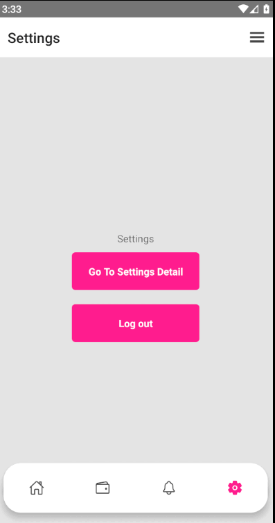

# Stack, Tab and Drawer navigation in React Native using React Navigation package v6.

In this project i am using react native stack tab and drawer navigation using React Navigations v6.

This project is done with the help of API from https://countrystatecity.in/ and the select dropdown has been created with [react native element dropdown](https://github.com/hoaphantn7604/react-native-element-dropdown) package.

## Project Setup
- Install the packages by using `npm install` command
- Run android `npx react-native run-android` by this command
- Run android `npx react-native run-ios` by this command

## App Screenshot

